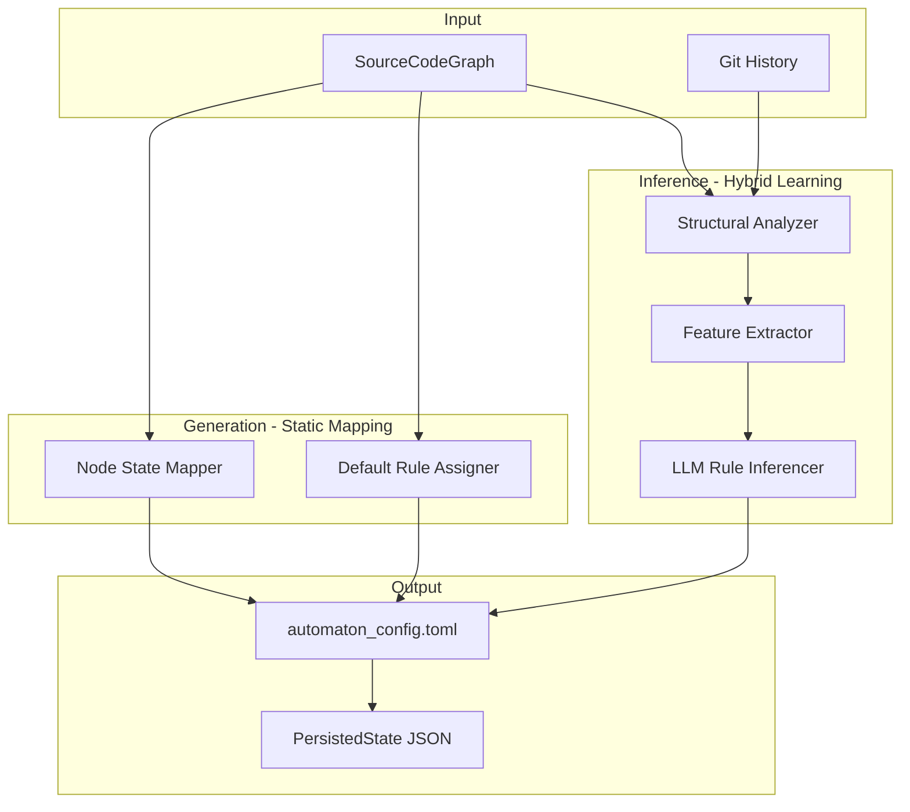

# Automaton Description Generator & Inferencer

## Architecture Overview



## Storage Location

Config lives in the existing `.self/automaton/` folder alongside other automaton data:

```
.self/
├── automaton/
│   ├── config.json          # NEW: Automaton description/rules
│   ├── state.json           # Current automaton state  
│   ├── tick_history.json    # Tick history
│   └── snapshots/           # Historical snapshots
├── graph.json               # SourceCodeGraph
└── manifest.json            # Workspace manifest
```

Integration with existing [`AutomatonStore`](crates/vibe-graph-automaton/src/persistence.rs):

- Add `save_config()` / `load_config()` methods to `AutomatonStore`
- Config file path: `.self/automaton/config.json`
- Uses `serde_json` (already a dependency) for consistency

## Stability Model

**Stability** is the initial activation derived from source code analysis. It serves two purposes:

1. **Equilibrium baseline**: The stable state the system tends to return to after perturbations
2. **Damping factor**: High stability nodes resist change (slower state transitions)
```
new_activation = current_activation + (delta * (1.0 - stability * damping_coefficient))
```


When generating from source code:

- Entry points (main.rs, lib.rs) -> high stability (0.8-1.0)
- Core modules with many dependents -> high stability
- Leaf nodes / utilities -> medium stability (0.4-0.6)
- New/isolated files -> low stability (0.1-0.3)

## Hierarchical Rules (Folders as Local Rule Descriptors)

Folders are nodes with **independent state** that influences their children. They define local rules for CRUD operations on their contents.

**Rule Inheritance Modes** (configurable per-folder, default = `compose`):

| Mode | Behavior |

|------|----------|

| `inherit_override` | Children fully inherit parent rules, can override |

| `inherit_opt_in` | Children inherit as defaults, must explicitly opt-in |

| `compose` | Both parent and child rules apply (default) |

**Folder node structure:**

```json
{
  "id": 5,
  "path": "src/models/",
  "kind": "Directory",
  "stability": 0.9,
  "rule": "directory_hub",
  "inheritance_mode": "compose",
  "local_rules": {
    "on_file_add": "validate_model_structure",
    "on_file_delete": "check_no_external_dependents",
    "on_file_update": "propagate_to_importers",
    "on_child_activation_change": "aggregate_and_propagate"
  }
}
```

**Propagation flow:**

```
file change -> file rules -> folder.on_file_update -> parent folder -> ...
```

## Configuration Schema

```json
{
  "meta": {
    "name": "my-project",
    "generated_at": "2025-01-15T10:30:00Z",
    "source": "generation"
  },
  "defaults": {
    "initial_activation": 0.0,
    "default_rule": "identity",
    "damping_coefficient": 0.5,
    "inheritance_mode": "compose"
  },
  "nodes": [
    {
      "id": 1,
      "path": "src/",
      "kind": "Directory",
      "stability": 0.95,
      "rule": "source_root",
      "inheritance_mode": "compose",
      "local_rules": {
        "on_file_add": "validate_source_file",
        "on_child_activation_change": "aggregate_stability"
      }
    },
    {
      "id": 2,
      "path": "src/lib.rs",
      "kind": "File",
      "stability": 1.0,
      "rule": "entry_point",
      "payload": { "imports": 5, "exports": 3, "loc": 150 }
    },
    {
      "id": 3,
      "path": "src/utils/",
      "kind": "Directory",
      "stability": 0.6,
      "rule": "utility_container",
      "local_rules": {
        "on_file_update": "propagate_to_importers"
      }
    },
    {
      "id": 4,
      "path": "src/utils/helpers.rs",
      "kind": "File",
      "stability": 0.5,
      "rule": "utility_propagation"
    }
  ],
  "rules": [
    {
      "name": "identity",
      "type": "builtin"
    },
    {
      "name": "entry_point",
      "type": "llm",
      "system_prompt": "You are the entry point of the application. When activated:\n- Propagate activation to direct dependencies\n- Summarize key state changes"
    },
    {
      "name": "utility_propagation",
      "type": "llm",
      "system_prompt": "This is a utility module. Activation propagates upward to importers when internal state changes significantly."
    }
  ]
}
```

## Implementation Plan

### Phase 1: Configuration Schema and Loader

Create the config types in [`crates/vibe-graph-automaton/src/config.rs`](crates/vibe-graph-automaton/src/config.rs):

- `AutomatonConfig` - root config struct
- `NodeConfig` - per-node settings (activation, rule, payload)
- `RuleConfig` - rule definitions (builtin vs LLM with prompts)

Extend existing [`AutomatonStore`](crates/vibe-graph-automaton/src/persistence.rs):

- Add `save_config(&self, config: &AutomatonConfig)` method
- Add `load_config(&self) -> Option<AutomatonConfig>` method
- Config stored at `.self/automaton/config.json`
- Integration with existing `SourceCodeAutomatonBuilder`

### Phase 2: Generation Module (Static Mapping)

Create [`crates/vibe-graph-automaton/src/description/generator.rs`](crates/vibe-graph-automaton/src/description/generator.rs):

**Stability Calculator:**

Compute stability based on structural importance:

- Entry points (main.rs, lib.rs, index.ts) -> stability = 1.0
- High in-degree (many importers) -> stability = 0.7 + 0.3 * normalized_in_degree
- Core modules (high betweenness centrality) -> stability boost
- Leaf nodes (no dependents) -> stability = 0.3
- New/isolated files -> stability = 0.1

**Payload Extractor:**

- Extract metrics from node metadata: loc, imports, exports
- Compute derived features: import/export ratio

**Rule Assigner:**

- Assign rules based on node characteristics:
  - Entry points -> `entry_point` rule
  - High stability hubs -> `hub` rule  
  - Low stability leaves -> `sink` rule
  - Medium stability utilities -> `utility_propagation` rule

### Phase 3: Inference Module (Hybrid Learning)

Create [`crates/vibe-graph-automaton/src/description/inferencer.rs`](crates/vibe-graph-automaton/src/description/inferencer.rs):

**Structural Analyzer:**

- Compute graph metrics: centrality, clustering, import/export ratios
- Identify architectural patterns: layers, hubs, utilities
- Optionally analyze git history for co-change patterns

**LLM Rule Inferencer:**

- Feed structural features to LLM
- Prompt: "Given this node's role (hub, entry point, utility), generate a system prompt that describes how it should evolve"
- Parse LLM response into `RuleConfig`

### Phase 4: CLI Integration

Add commands to [`crates/vibe-graph-cli/src/main.rs`](crates/vibe-graph-cli/src/main.rs):

```
vg automaton generate [PATH]           # Generate config from graph
vg automaton infer [PATH] --model X    # Infer rules using LLM
vg automaton run [PATH] --config X     # Run with config file
```

## Key Files to Create/Modify

| File | Action | Purpose |

|------|--------|---------|

| `crates/vibe-graph-automaton/src/config.rs` | Create | Config schema structs |

| `crates/vibe-graph-automaton/src/persistence.rs` | Modify | Add save_config/load_config to AutomatonStore |

| `crates/vibe-graph-automaton/src/description/mod.rs` | Create | Module declaration |

| `crates/vibe-graph-automaton/src/description/generator.rs` | Create | Static mapping logic |

| `crates/vibe-graph-automaton/src/description/inferencer.rs` | Create | Hybrid learning logic |

| `crates/vibe-graph-automaton/src/lib.rs` | Modify | Export new modules |

| `crates/vibe-graph-cli/src/main.rs` | Modify | Add automaton subcommands |

| `crates/vibe-graph-cli/src/commands/automaton.rs` | Create | CLI command handlers |

## Dependencies

- `serde_json` - already in use for other `.self/automaton/` files
- `petgraph` - already in use, use its algorithms for centrality metrics